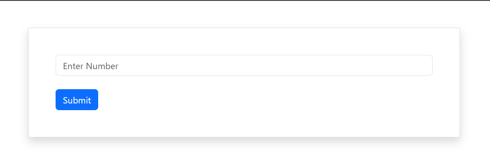

# 🔢 JavaScript Number Match Checker

A simple and interactive **Number Match Checker** built using **HTML5** and **JavaScript**. This project allows users to enter a number and instantly checks whether it matches a predefined value using JavaScript conditional logic.

---

## 📖 Overview

The **Number Match Checker** is a beginner-friendly JavaScript project designed to practice user input handling, DOM manipulation, conditional statements, and form validation. When a user enters a number, the application validates the input and displays an appropriate alert message indicating whether the entered number matches the predefined value.

---

## 📸 Project Preview



> If the image doesn't appear on GitHub, use this URL instead:

```markdown

```

---


## ✨ Features

- 🔢 Check if a number matches a predefined value
- ⚡ Instant result using JavaScript alerts
- ✅ Input validation for empty fields
- 🎯 Simple and beginner-friendly interface
- 🚀 Fast and responsive interaction

---

## 🛠️ Technologies Used

- HTML5
- JavaScript (ES6)

---

## 📚 JavaScript Concepts Used

- Functions
- DOM Manipulation
- `document.getElementById()`
- `.value` Property
- `if...else` Statements
- Strict Equality Operator (`===`)
- Equality Operator (`==`)
- `alert()`
- Input Validation
- User Input Handling

---

## 📂 Project Structure

```text
javascript-number-match-checker/
│
├── index.html
├── script.js
├── preview.png
└── README.md
```

---

## 🚀 How to Run

1. Clone the repository

```bash
git clone https://github.com/Joni250/javascript-number-match-checker.git
```

2. Open the project folder.

3. Run `index.html` in your preferred web browser.

---

## 🌐 Live Demo

**GitHub Pages**

```
https://joni250.github.io/javascript-number-match-checker/
```

*(Enable GitHub Pages from **Settings → Pages** after uploading the project.)*

---

## 🎯 Learning Objectives

This project helped me improve my understanding of:

- JavaScript Fundamentals
- Conditional Statements
- DOM Manipulation
- User Input Validation
- Event Handling
- Front-End Web Development

---

## 💡 Future Improvements

- Support multiple matching numbers
- Display results on the page instead of alerts
- Reset button
- Keyboard Enter key support
- Improved UI with Bootstrap
- Success and error message animations

---

## 👩‍💻 Author

** Mst Joni Khatun**

GitHub: **https://github.com/Joni250**

---

## ⭐ Support

If you found this project useful, please consider giving it a ⭐ on GitHub. Your support motivates me to build and share more web development projects.

---

## 📄 License

This project is open source and available under the **MIT License**.
